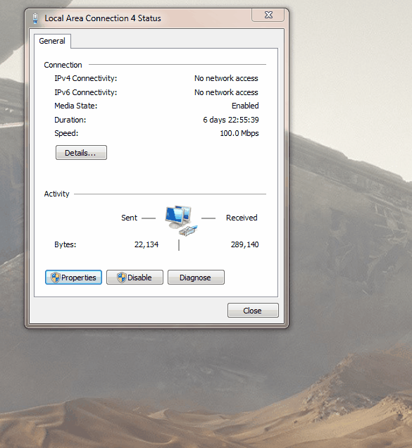
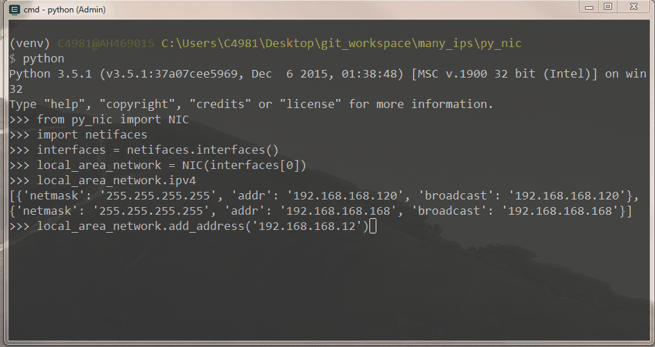

.. PyNIC documentation master file, created by
   sphinx-quickstart on Wed Mar 22 07:55:00 2017.
   You can adapt this file completely to your liking, but it should at least
   contain the root `toctree` directive.

Welcome to PyNIC's documentation!
=================================

.. toctree::
   :maxdepth: 2
   :caption: Contents:
   
   
What is PyNIC?
**************
This module contains helpers to make working with an interface on Windows easy to do in an automated fashion.
   
Turning this
************

Into this
*********

How can I have this?
********************
Use pip to install from the Github repository::
    
    C:\directory> pip install -e git+https://github.com/sircodesalittle/py_nic.git#egg=py_nic
    C:\directory> python
    >>> import py_nic
    

   
   
py_nic module
=============

.. automodule:: py_nic
    :members:
    :undoc-members:
    :show-inheritance:
   